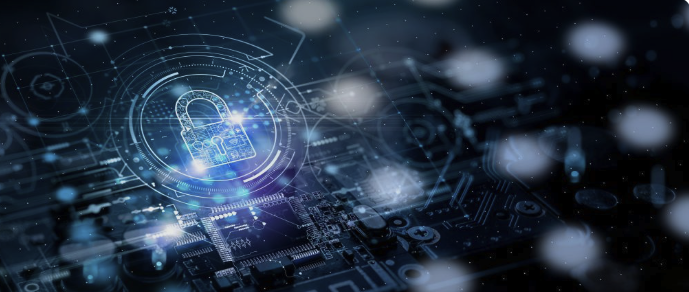
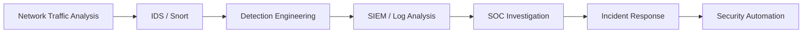

# 🛡️ Security Labs — SOC, Detection Engineering & Blue Team




> **Hands-on defensive cybersecurity portfolio focused on SOC operations, network analysis, intrusion detection, detection engineering, and security monitoring.**

This repository documents practical security labs designed to demonstrate how I investigate traffic, build detections, validate alerts, reduce false positives, and document troubleshooting in realistic lab environments.

The objective is to build a portfolio that shows not only tools and commands, but also the **analysis process behind defensive security work**.

---

## 🎯 Current Focus

| Area | Status | Focus |
|---|---|---|
| Snort IDS / Network Detection | 🟢 Active | Signature development, scan detection, thresholding |
| Wireshark Network Analysis | 🟢 Active | Packet inspection and traffic comparison |
| Detection Engineering | 🟢 Active | Building and tuning actionable detections |
| SOC Investigation | 🟡 Expanding | Alert triage and investigation workflow |
| SIEM / Log Analysis | 🟡 Expanding | Search, correlation, and event analysis |
| Incident Response | 🔵 Roadmap | Investigation and response scenarios |
| Security Automation | 🔵 Roadmap | Scripts and repeatable analyst workflows |

---

## 🧭 Security Lab Roadmap



The portfolio is being developed around one core principle:

**Observe → Detect → Validate → Tune → Investigate → Respond → Automate**

---

## ⭐ Featured Project

### Snort IDS Lab — ICMP and TCP Scan Detection

➡️ [`snort-ids-lab/`](snort-ids-lab/)

Hands-on intrusion detection lab using **Snort 2.9, Nmap, Wireshark, Ubuntu Linux, and Windows**.

### Skills demonstrated

- Custom Snort IDS signatures
- ICMP traffic analysis
- Nmap ping-scan detection
- TCP SYN scan detection
- Packet-size and payload analysis
- `detection_filter` tuning
- `event_filter` alert suppression
- False-positive reduction
- Rule syntax validation
- Linux vs Windows ICMP fingerprinting
- Network troubleshooting
- Defensive lab documentation

### Detection workflow

```text
Traffic generation
      ↓
Packet capture
      ↓
Wireshark analysis
      ↓
Detection hypothesis
      ↓
Snort rule
      ↓
Validation
      ↓
Noise reduction
      ↓
Final documented detection
```

---

## 🔬 Lab Methodology

Each security lab should document:

1. **Objective** — what security problem is being tested.
2. **Environment** — systems, network, tools, and relevant versions.
3. **Traffic / Evidence** — how the behavior was generated or captured.
4. **Analysis** — packet, log, or event characteristics.
5. **Detection** — rule, query, or analytic logic.
6. **Validation** — proof that the detection works.
7. **Tuning** — false-positive and alert-noise reduction.
8. **Troubleshooting** — what failed and how it was investigated.
9. **Key takeaways** — what the lab demonstrated.

---

## 🧰 Tools & Technologies

| Category | Tools / Technologies |
|---|---|
| Network IDS | Snort |
| Network Analysis | Wireshark |
| Traffic Generation | Nmap |
| Operating Systems | Linux, Windows |
| Security Monitoring | IDS alerts, packet captures |
| Lab Infrastructure | Virtual machines / isolated lab |
| Documentation | GitHub, screenshots, configuration files |

---

## 🗂️ Repository Structure

```text
security-labs-/
├── README.md
├── assets/
│   └── security-labs-banner.png
└── snort-ids-lab/
    ├── README.md
    ├── config/
    ├── rules/
    └── screenshots/
```

The detailed Snort project remains self-contained so that the root README acts as the **portfolio landing page**, while each lab provides the technical evidence.

---

## 🔐 Security & Ethics

All exercises in this repository are performed in isolated or authorized lab environments for defensive cybersecurity learning.

This repository should never contain:

- real credentials or passwords;
- private keys;
- API secrets;
- production customer data;
- sensitive company information;
- unauthorized attack data.

---

## 🚀 Portfolio Direction

Planned future additions may include:

- SIEM investigation labs
- Windows event-log analysis
- Linux log analysis
- Sigma detection rules
- SOC triage scenarios
- Incident-response exercises
- Detection-as-code
- Python / PowerShell security automation
- Cloud security monitoring
- Endpoint and identity investigation

These areas will be added only as hands-on work is completed and documented.

---

## 👤 Author

**Laurent Mandine**

Infrastructure & Cybersecurity practitioner building hands-on skills across SOC operations, detection engineering, network security, cloud, and OT/ICS security.
