# Snort IDS Lab — ICMP and TCP Scan Detection

Hands-on intrusion detection lab using **Snort 2.9**, **Nmap**, and **Wireshark** in a small Windows/Ubuntu environment.

The goal of this lab was to build and tune custom Snort signatures, validate them against real network traffic, and reduce noisy detections through thresholding.

## Lab Environment

| System | Role | IP Address |
|---|---|---|
| Ubuntu | Snort sensor, Nmap scanner, Wireshark analyst | `10.50.10.101` |
| Windows | Monitored target | `10.50.10.100` |
| Network | Lab subnet | `10.50.10.0/24` |
| Ubuntu interface | Snort capture interface | `ens18` |

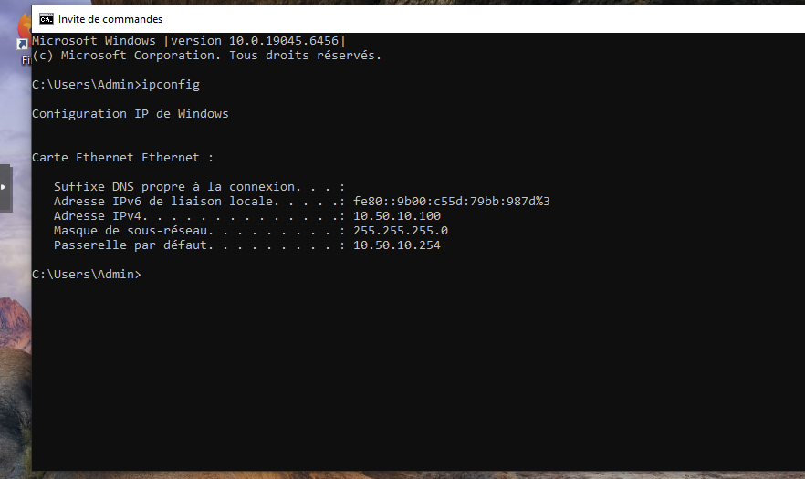

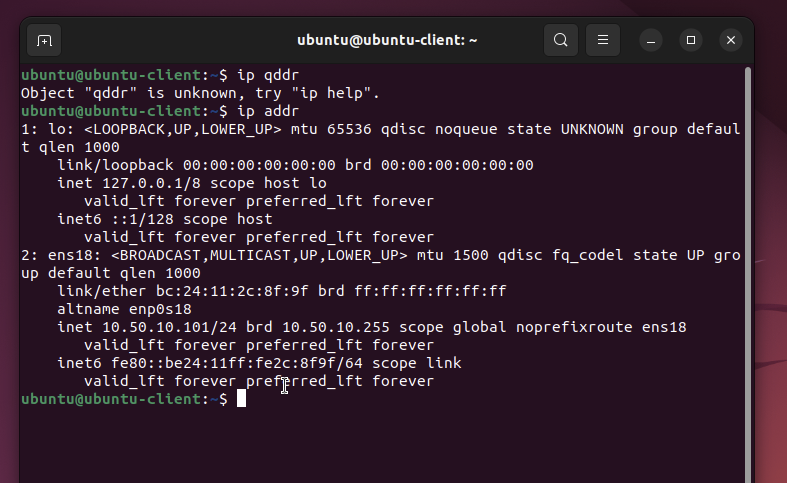

Connectivity between both hosts was verified before starting the detection work.

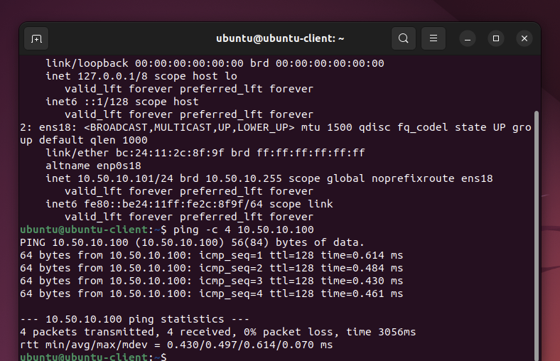

## Tools

- Snort `2.9.15.1`
- Nmap `7.80`
- Wireshark `3.6.2`
- Ubuntu Linux
- Windows 10
- Proxmox / noVNC lab environment

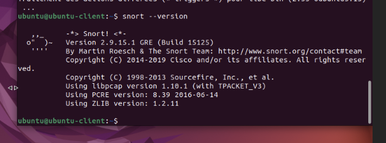

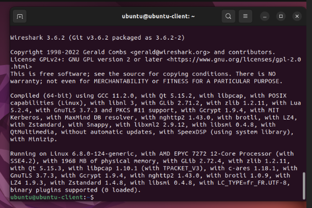

---

## 1. Basic ICMP Detection

The first custom rule alerted on any ICMP packet:

```snort
alert icmp any any -> any any (msg:"TRAFFIC ICMP"; sid:10000001;)
```

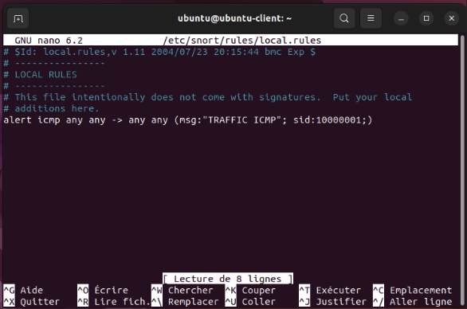

A normal ping from Ubuntu to Windows immediately generated alerts in Snort.

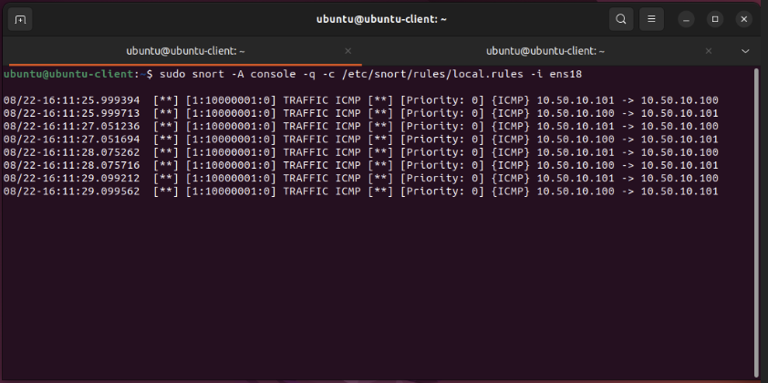

### Limitation

This rule was too broad. It detected both legitimate ICMP traffic and network discovery activity, creating unnecessary noise.

---

## 2. Nmap Ping Scan Analysis

A local Nmap host-discovery scan was tested with ARP discovery disabled:

```bash
sudo nmap -sP 10.50.10.0/24 --disable-arp-ping
```

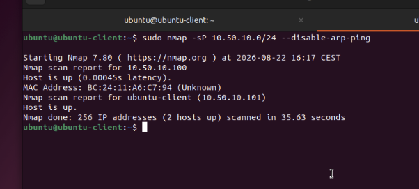

Wireshark was then used to compare a normal Linux ping with an Nmap-generated ICMP probe.

The key difference observed was packet size:

- Normal Linux ping request: **98 bytes**
- Nmap ping-scan request: **42 bytes**

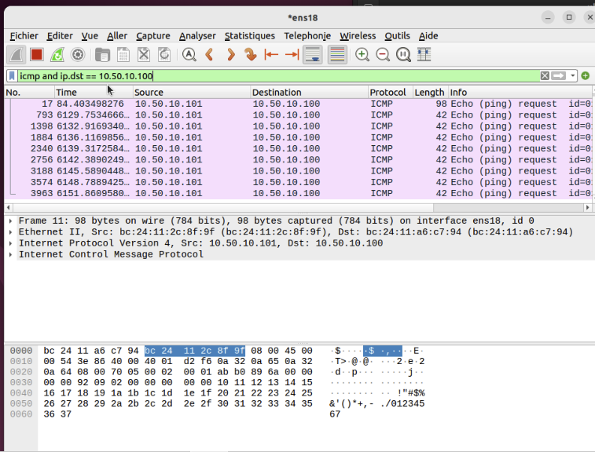

The Nmap probe had no ICMP payload, which allowed the signature to be made more specific.

---

## 3. Detecting Nmap Ping Scans with `dsize`

The ICMP rule was refined using `dsize:0`:

```snort
alert icmp any any -> any any (msg:"Possible ScanPing Nmap"; dsize:0; sid:10000001;)
```

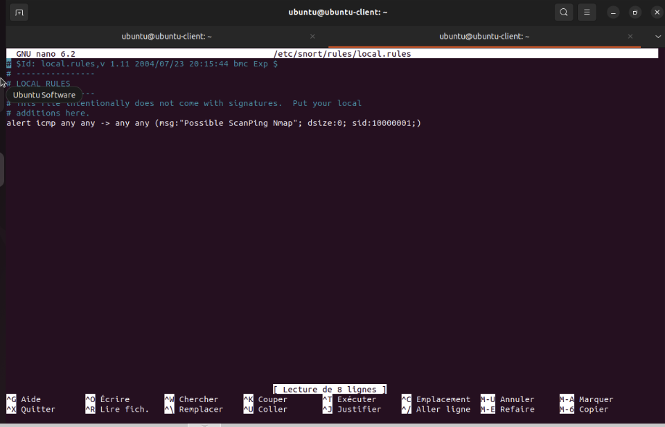

With this version:

- Normal ping traffic did **not** trigger the rule.
- Nmap ping-scan traffic generated `Possible ScanPing Nmap` alerts.

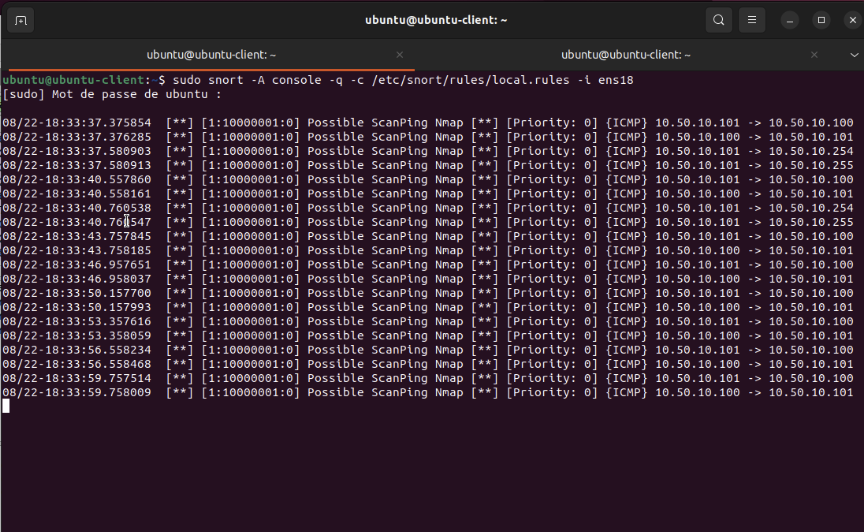

This significantly reduced false positives compared with the original generic ICMP rule.

---

## 4. TCP SYN Scan Detection

A TCP SYN scan was generated with Nmap:

```bash
sudo nmap -sS 10.50.10.100 --packet-trace
```

The packet trace clearly showed repeated TCP SYN probes against many destination ports.

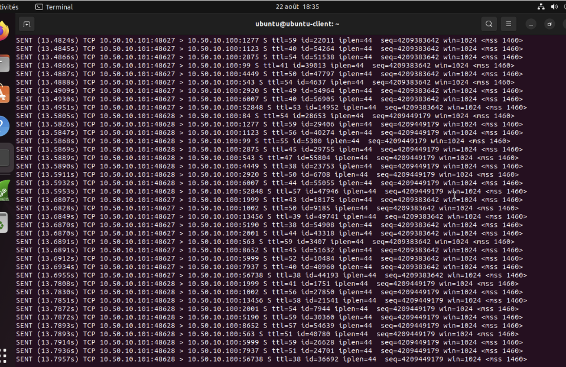

An initial Snort rule targeted TCP traffic to port 443:

```snort
alert tcp any any -> 10.50.10.100 443 (msg:"Scan TCP"; sid:10000010;)
```

Snort successfully detected the scan when Nmap probed TCP/443.

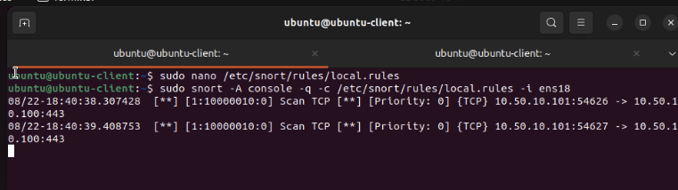

---

## 5. Threshold-Based TCP Scan Detection

Detecting only one port is too limited for real port-scan detection. The rule was improved with `detection_filter`:

```snort
alert tcp any any -> 10.50.10.100 any (msg:"Scan TCP"; detection_filter:track by_src, count 30, seconds 60; sid:10000011;)
```

This rule tracks the source IP and identifies a suspicious volume of TCP connection attempts over a short period.

### Result

The scan was correctly detected, but the rule generated a large number of alerts.

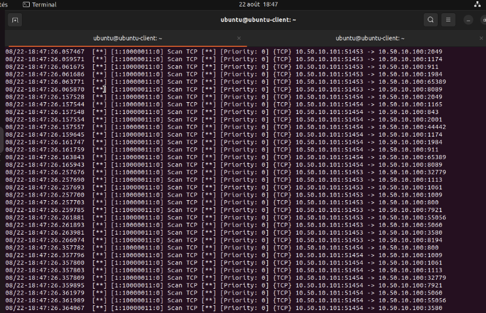

This demonstrates an important IDS tuning problem: **a technically correct detection can still be operationally noisy**.

---

## 6. Reducing Alert Flooding

An event filter was added to `/etc/snort/threshold.conf`:

```text
event_filter gen_id 1, sig_id 10000011, type limit, track by_src, count 1, seconds 120
```

Snort was then started with the main configuration so that `threshold.conf` was loaded:

```bash
sudo snort -A console -q -c /etc/snort/snort.conf -i ens18
```

The custom `Scan TCP` signature was reduced to one alert per source within the configured 120-second period.

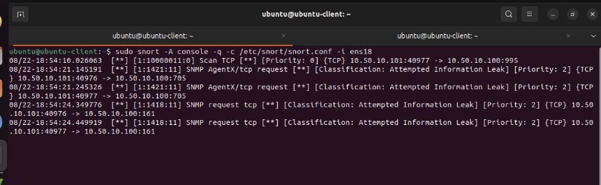

The main `snort.conf` also loaded Snort's preconfigured signatures, which explains the additional built-in alerts visible in the console.

---

## 7. Distinguishing Linux and Windows Ping Traffic

Two payload-based signatures were added to distinguish Linux and Windows ICMP echo requests.

### Linux

```snort
alert icmp 10.50.10.101 any -> 10.50.10.100 any (msg:"Ping Linux"; content:"01234567"; offset:40; sid:10000012; rev:1;)
```

### Windows

```snort
alert icmp 10.50.10.100 any -> 10.50.10.101 any (msg:"Ping Windows"; content:"abcdefghijklmnop"; depth:16; sid:10000013; rev:1;)
```

The final local rule set was validated before testing:

```bash
sudo snort -T -c /etc/snort/rules/local.rules
```

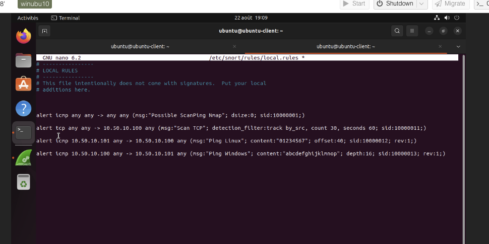

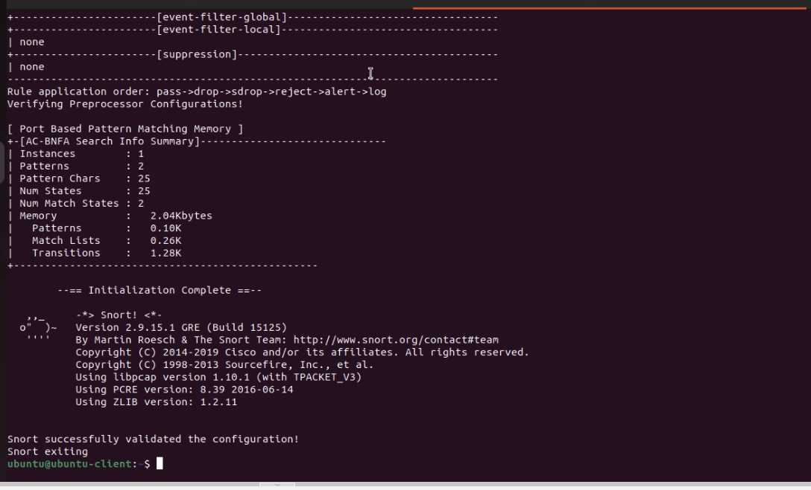

### Linux Ping Detection

A ping from Ubuntu to Windows generated `Ping Linux` alerts.

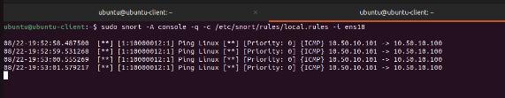

### Windows Ping Detection

A ping from Windows to Ubuntu generated `Ping Windows` alerts.

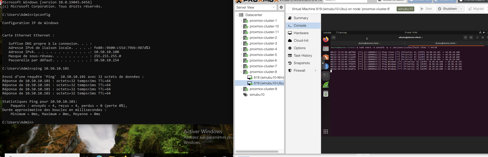

This demonstrated payload-based fingerprinting of ICMP echo requests.

---

## 8. FTP Authentication Failure Experiment

As an additional exercise, `vsftpd` was installed on Ubuntu and verified as active.

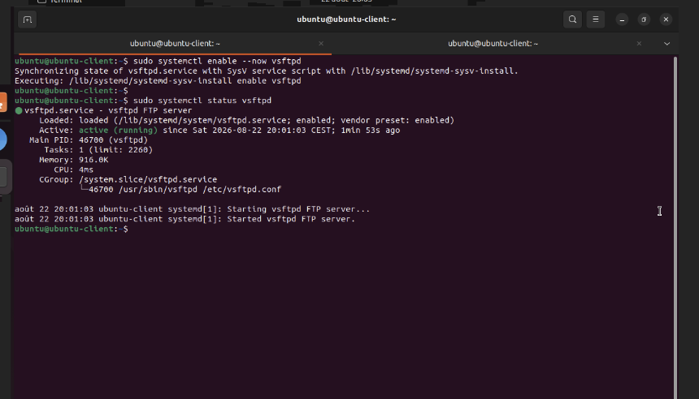

A failed FTP login was then generated from Windows:

```text
530 Login incorrect.
```

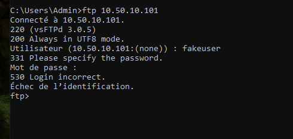

The traffic-generation portion of the experiment was successful. The content-matching Snort signature still required additional tuning in this specific Winubu environment, so this test is documented as an **incomplete detection experiment** rather than a validated signature.

---

## Final Local Rules

The validated rules from the completed parts of the lab are stored in:

```text
rules/local.rules
```

Current rule set:

```snort
alert icmp any any -> any any (msg:"Possible ScanPing Nmap"; dsize:0; sid:10000001;)

alert tcp any any -> 10.50.10.100 any (msg:"Scan TCP"; detection_filter:track by_src, count 30, seconds 60; sid:10000011;)

alert icmp 10.50.10.101 any -> 10.50.10.100 any (msg:"Ping Linux"; content:"01234567"; offset:40; sid:10000012; rev:1;)

alert icmp 10.50.10.100 any -> 10.50.10.101 any (msg:"Ping Windows"; content:"abcdefghijklmnop"; depth:16; sid:10000013; rev:1;)
```

---

## Key Takeaways

- Built custom Snort rules from observed packet behavior.
- Used Wireshark to identify reliable detection characteristics.
- Distinguished normal ICMP traffic from Nmap discovery probes.
- Detected TCP SYN scanning with both port-specific and rate-based logic.
- Used `detection_filter` to identify repeated connection attempts.
- Used `event_filter` to reduce alert flooding.
- Validated Snort rule syntax before deployment.
- Distinguished Linux and Windows ICMP echo requests using payload signatures.
- Documented an incomplete FTP detection experiment without overstating the result.

## Repository Structure

```text
snort-ids-lab/
├── README.md
├── config/
│   └── threshold.conf
├── rules/
│   └── local.rules
└── screenshots/
    ├── 01-windows-ipconfig.png
    ├── 02-ubuntu-ip-address.png
    ├── ...
    └── 21-ftp-login-failure.png
```

## Disclaimer

This lab was performed in an isolated training environment for defensive security learning and IDS rule development.
